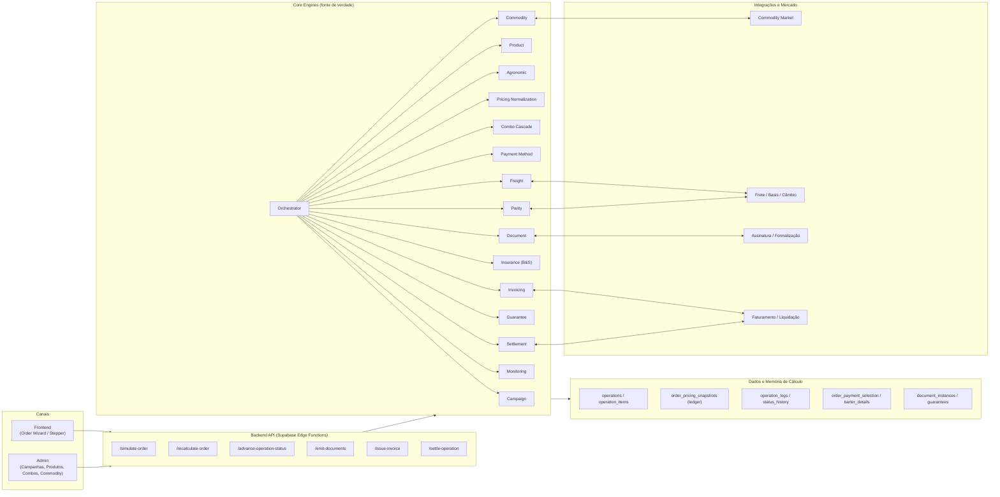
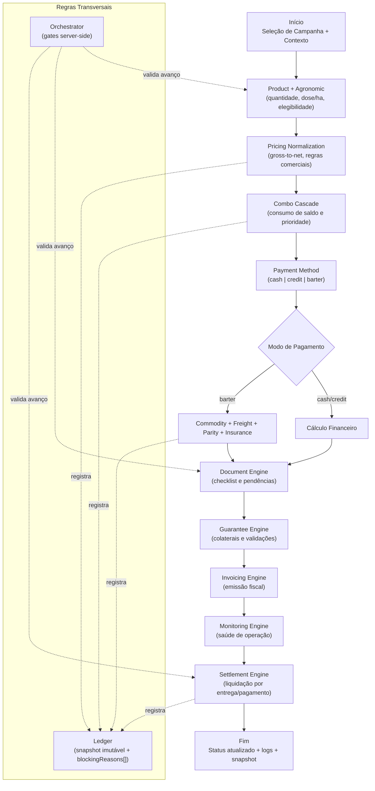

# Diagramas — Arquitetura e Fluxo do Sistema

Este documento traduz a arquitetura descrita em `docs/ARCHITECTURE_BARTEPRO_UNIFICADA_20_ONDAS.md` para dois diagramas: **arquitetura** (visão estrutural) e **fluxo** (visão de execução/jornada).

## 1) Diagrama de Arquitetura (System of Systems)

## 2) Diagrama de Fluxo (Execução da Simulação ao Settlement)

## Observações
- Os diagramas seguem os princípios **order-first**, **engine-first**, **ledger-first** e **workflow data-driven** descritos na documentação base.
- O fluxo explicita o ponto de bifurcação de pagamento (financeiro versus barter) e a convergência em documentos/garantias até a liquidação.
